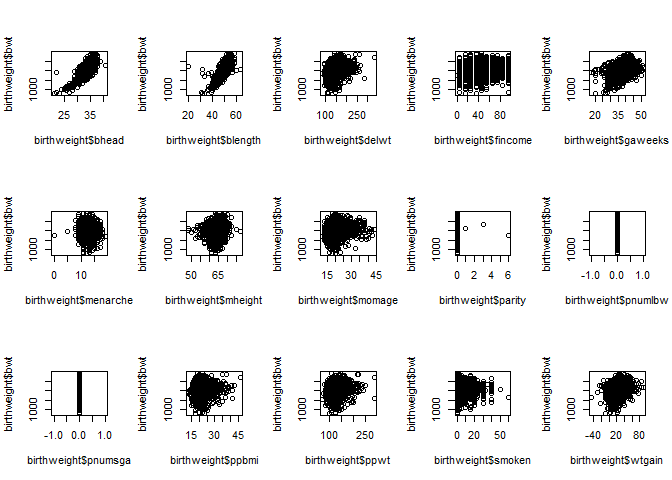
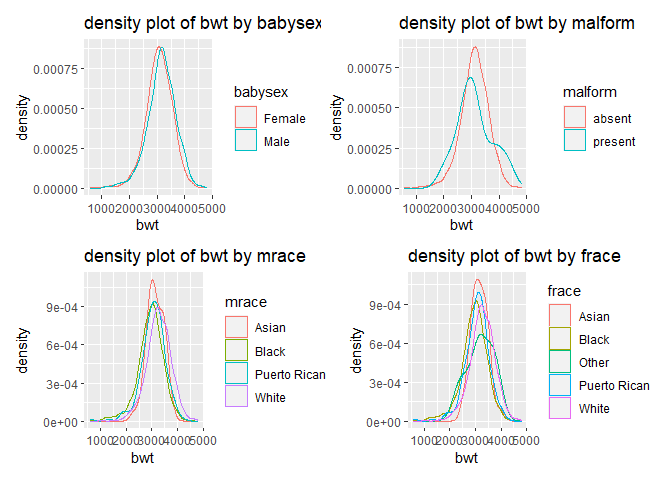
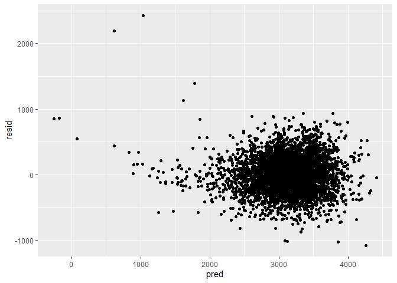
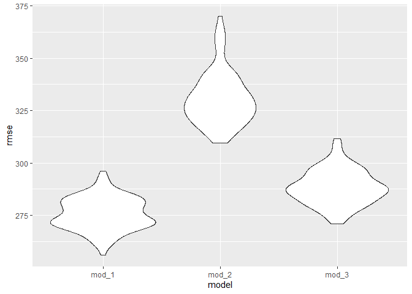

p8105\_hw6\_xz3078
================

## Problem 1

``` r
birthweight = read.csv("./birthweight.csv") %>%
  mutate(babysex = as.factor(recode(babysex, "1" = "Male", "2" = "Female")),
         frace = as.factor(recode(frace, "1" = "White", "2" = "Black", "3" = "Asian", "4" = "Puerto Rican", "8" = "Other", "9" = "Unknown")),
         malform = as.factor(recode(malform, "0" = "absent", "1" = "present")),
         mrace = as.factor(recode(mrace, "1" = "White", "2" = "Black", "3" = "Asian", "4" = "Puerto Rican", "8" = "Other")))

any(is.na(birthweight))
```

    ## [1] FALSE

There’s no missing data in the dataset.

``` r
par(mfrow = c(3,5))
plot(x = birthweight$bhead, y = birthweight$bwt)
plot(x = birthweight$blength, y = birthweight$bwt)
plot(x = birthweight$delwt, y = birthweight$bwt)
plot(x = birthweight$fincome, y = birthweight$bwt)
plot(x = birthweight$gaweeks, y = birthweight$bwt)
plot(x = birthweight$menarche, y = birthweight$bwt)
plot(x = birthweight$mheight, y = birthweight$bwt)
plot(x = birthweight$momage, y = birthweight$bwt)
plot(x = birthweight$parity, y = birthweight$bwt)
plot(x = birthweight$pnumlbw, y = birthweight$bwt)
plot(x = birthweight$pnumsga, y = birthweight$bwt)
plot(x = birthweight$ppbmi, y = birthweight$bwt)
plot(x = birthweight$ppwt, y = birthweight$bwt)
plot(x = birthweight$smoken, y = birthweight$bwt)
plot(x = birthweight$wtgain, y = birthweight$bwt)
```

<!-- -->

``` r
plot_sex = birthweight %>%
  group_by(babysex) %>%
  ggplot(aes(x = bwt, color = babysex)) +
  geom_density() +
  labs(title = "density plot of bwt by babysex")
plot_mrace = birthweight %>%
  group_by(mrace) %>%
  ggplot(aes(x = bwt, color = mrace)) +
  geom_density() +
  labs(title = "density plot of bwt by mrace")
plot_frace = birthweight %>%
  group_by(frace) %>%
  ggplot(aes(x = bwt, color = frace)) +
  geom_density() +
  labs(title = "density plot of bwt by frace")
plot_malform = birthweight %>%
  group_by(malform) %>%
  ggplot(aes(x = bwt, color = malform)) +
  geom_density() +
  labs(title = "density plot of bwt by malform")

(plot_sex + plot_malform) / (plot_mrace + plot_frace)
```

<!-- -->

We can see from the plots that bhead and blength seem to have linear
relationships with birthweight.

``` r
#list = as_tibble(c("babysex", "delwt", "fincome", "frace", "gaweeks", "malform", "menarche", "mheight", "momage", "mrace", "parity", "pnumlbw", "pnumsga", "ppbmi", "ppwt", "smoken", "wtgain"))

anova_1 = anova(lm(bwt ~ bhead + blength, data = birthweight), lm(bwt ~ bhead + blength + babysex, data = birthweight)) %>% 
    broom::tidy() %>% mutate(variable = "babysex")
anova_2 = anova(lm(bwt ~ bhead + blength, data = birthweight), lm(bwt ~ bhead + blength + delwt, data = birthweight)) %>% 
    broom::tidy() %>% mutate(variable = "delwt")
anova_3 = anova(lm(bwt ~ bhead + blength, data = birthweight), lm(bwt ~ bhead + blength + fincome, data = birthweight)) %>% 
    broom::tidy() %>% mutate(variable = "fincome")
anova_4 = anova(lm(bwt ~ bhead + blength, data = birthweight), lm(bwt ~ bhead + blength + frace, data = birthweight)) %>% 
    broom::tidy() %>% mutate(variable = "frace")
anova_5 = anova(lm(bwt ~ bhead + blength, data = birthweight), lm(bwt ~ bhead + blength + gaweeks, data = birthweight)) %>% 
    broom::tidy() %>% mutate(variable = "gaweeks")
anova_6 = anova(lm(bwt ~ bhead + blength, data = birthweight), lm(bwt ~ bhead + blength + malform, data = birthweight)) %>% 
    broom::tidy() %>% mutate(variable = "malform")
anova_7 = anova(lm(bwt ~ bhead + blength, data = birthweight), lm(bwt ~ bhead + blength + menarche, data = birthweight)) %>% 
    broom::tidy() %>% mutate(variable = "menarche")
anova_8 = anova(lm(bwt ~ bhead + blength, data = birthweight), lm(bwt ~ bhead + blength + mheight, data = birthweight)) %>% 
    broom::tidy() %>% mutate(variable = "mheight")
anova_9 = anova(lm(bwt ~ bhead + blength, data = birthweight), lm(bwt ~ bhead + blength + momage, data = birthweight)) %>% 
    broom::tidy() %>% mutate(variable = "momage")
anova_10 = anova(lm(bwt ~ bhead + blength, data = birthweight), lm(bwt ~ bhead + blength + mrace, data = birthweight)) %>% 
    broom::tidy() %>% mutate(variable = "mrace")
anova_11 = anova(lm(bwt ~ bhead + blength, data = birthweight), lm(bwt ~ bhead + blength + parity, data = birthweight)) %>% 
    broom::tidy() %>% mutate(variable = "parity")
anova_12 = anova(lm(bwt ~ bhead + blength, data = birthweight), lm(bwt ~ bhead + blength + pnumlbw, data = birthweight)) %>% 
    broom::tidy() %>% mutate(variable = "pnumlbw")
anova_13 = anova(lm(bwt ~ bhead + blength, data = birthweight), lm(bwt ~ bhead + blength + pnumsga, data = birthweight)) %>% 
    broom::tidy() %>% mutate(variable = "pnumsga")
anova_14 = anova(lm(bwt ~ bhead + blength, data = birthweight), lm(bwt ~ bhead + blength + ppbmi, data = birthweight)) %>% 
    broom::tidy() %>% mutate(variable = "ppbmi")
anova_15 = anova(lm(bwt ~ bhead + blength, data = birthweight), lm(bwt ~ bhead + blength + ppwt, data = birthweight)) %>% 
    broom::tidy() %>% mutate(variable = "ppwt")
anova_16 = anova(lm(bwt ~ bhead + blength, data = birthweight), lm(bwt ~ bhead + blength + smoken, data = birthweight)) %>% 
    broom::tidy() %>% mutate(variable = "smoken")
anova_17 = anova(lm(bwt ~ bhead + blength, data = birthweight), lm(bwt ~ bhead + blength + wtgain, data = birthweight)) %>% 
    broom::tidy() %>% mutate(variable = "wtgain")
rbind(anova_1, anova_2, anova_3, anova_4, anova_5, anova_6, anova_7, anova_8, anova_9, anova_10, anova_11, anova_12, anova_13, anova_14, anova_15, anova_16, anova_17) %>% drop_na(df)
```

    ## # A tibble: 17 x 7
    ##    res.df        rss    df     sumsq statistic   p.value variable
    ##     <dbl>      <dbl> <dbl>     <dbl>     <dbl>     <dbl> <chr>   
    ##  1   4338 361052685.     1  1778849.    21.4    3.89e- 6 babysex 
    ##  2   4338 354026448.     1  8805086.   108.     5.56e-25 delwt   
    ##  3   4338 357878582.     1  4952952.    60.0    1.15e-14 fincome 
    ##  4   4335 346841077.     4 15990457.    50.0    3.61e-41 frace   
    ##  5   4338 355164031.     1  7667503.    93.7    6.26e-22 gaweeks 
    ##  6   4338 362813059.     1    18474.     0.221  6.38e- 1 malform 
    ##  7   4338 362623718.     1   207816.     2.49   1.15e- 1 menarche
    ##  8   4338 357790035.     1  5041499.    61.1    6.68e-15 mheight 
    ##  9   4338 359997579.     1  2833954.    34.1    5.48e- 9 momage  
    ## 10   4336 345747996.     3 17083538.    71.4    4.46e-45 mrace   
    ## 11   4338 362555330.     1   276204.     3.30   6.91e- 2 parity  
    ## 12   4339 362831534.     0        0     NA     NA        pnumlbw 
    ## 13   4339 362831534.     0        0     NA     NA        pnumsga 
    ## 14   4338 362349742.     1   481792.     5.77   1.64e- 2 ppbmi   
    ## 15   4338 359602295.     1  3229239.    39.0    4.75e-10 ppwt    
    ## 16   4338 362325760.     1   505774.     6.06   1.39e- 2 smoken  
    ## 17   4338 355943583.     1  6887951.    83.9    7.67e-20 wtgain

From the anova test above, we can see the bhead, blength, babysex,
delwt, fincome, frace, gaweeks, mheight, momage, mrace, ppwt, wtgain are
all related to birthweight since their p value are extremely small.

``` r
fit = lm(bwt ~ bhead + blength + babysex + delwt + fincome + frace + gaweeks + mheight + momage + mrace + ppwt + wtgain, data = birthweight)
birthweight %>% 
  modelr::add_predictions(fit) %>%
  modelr::add_residuals(fit) %>%
  ggplot(aes(x = pred, y = resid)) +
  geom_point() 
```

    ## Warning in predict.lm(model, data): prediction from a rank-deficient fit may be
    ## misleading

    ## Warning in predict.lm(model, data): prediction from a rank-deficient fit may be
    ## misleading

<!-- -->

``` r
cv_df = 
  crossv_mc(birthweight, 100) %>% 
  mutate(
    train = map(train, as_tibble),
    test = map(test, as_tibble)) %>%
  mutate(
    mod_1 = map(train, ~lm(bwt ~ bhead + blength + babysex + delwt + fincome + frace + gaweeks + mheight + momage + mrace + ppwt + wtgain, data = .x)),
    mod_2 = map(train, ~lm(bwt ~ blength + gaweeks, data = .x)),
    mod_3 = map(train, ~lm(bwt ~ bhead + blength + babysex + bhead * blength +bhead * babysex + babysex * blength + babysex * blength * bhead, data = .x))) %>% 
  mutate(
    rmse_mod_1 = map2_dbl(mod_1, test, ~rmse(model = .x, data = .y)),
    rmse_mod_2 = map2_dbl(mod_2, test, ~rmse(model = .x, data = .y)),
    rmse_mod_3 = map2_dbl(mod_3, test, ~rmse(model = .x, data = .y)))

cv_df %>% 
  select(starts_with("rmse")) %>% 
  pivot_longer(
    everything(),
    names_to = "model", 
    values_to = "rmse",
    names_prefix = "rmse_") %>% 
  mutate(model = fct_inorder(model)) %>% 
  ggplot(aes(x = model, y = rmse)) + geom_violin()
```

<!-- -->

## Problem 2
